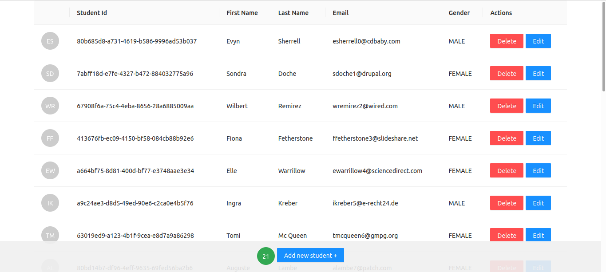

# SpringBootReact
A Project using Spring-Boot and React



# heroku
https://app-student255.herokuapp.com/

# requirements
```
Java 11
Maven 3.6.3
PostgreSQL with a database and username called guilty
```

# build and run
```
git clone https://github.com/FLAIR7/SpringBootReact.git
mvn clean install -Pdemo
cd target
java -jar demo-0.0.1-SNAPSHOT.jar
```

# path
```
http://localhost:8080/: Frontend integrated
http://localhost:8080/api/students: Get all students
http://localhost:8080/api/students/{studentId}/courses: Get the courses relating to the student
```
